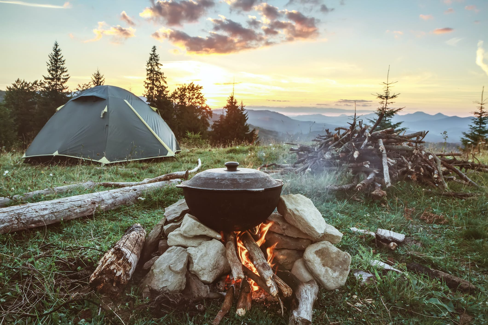

# Alexander Dieringer

#### Interesting Facts

Hey I'm Alex and I like to read, travel, game, and code.  When I'm reading I usually prefer to read Sci-Fi or Fantasy, but a good Thriller or Mystery story is always good.  Other than reading you'll probably see me playing either an MMO, RPG, or RTS game if I'm not trying to code my own game for fun.  I've traveled to eight different countries outside the United States, unless you want to group up the UK and then we're down to four instead.  When I'm traveling more locally I like to go camping and hiking in scenic areas. 

My favorite food is anything to do with blackberries really. Here have a picture 

---
#### Foods to try

Speaking of foods, I have a few I really enjoy and I think that everyone should try at least one of following things.

| **Name** | **Available At** | **Estimated Cost** |
| --- | --- | --- |
| Blackberry Frozen Yogurt | Nutrissa shops (Mexico) | $10 |
| Barbacoa Tacos (Leg of Lamb) | Latin America | $10 |
| Alambres | El Maguey restaurants | $12 |
| Blackberry Lemonade | Ruby Tuesday restaurants | $7 |

---
[Back to README](README.md)
